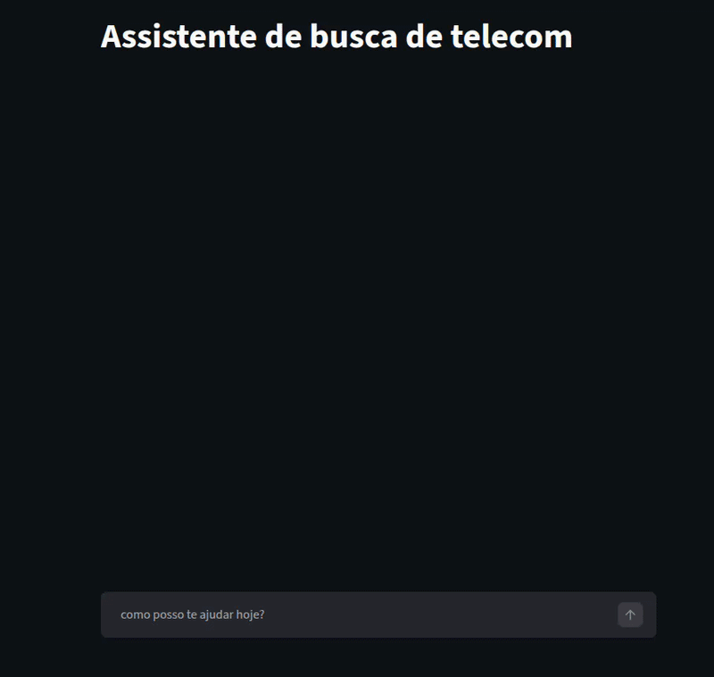
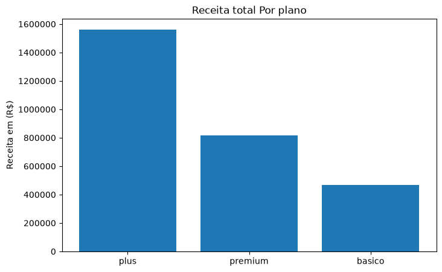
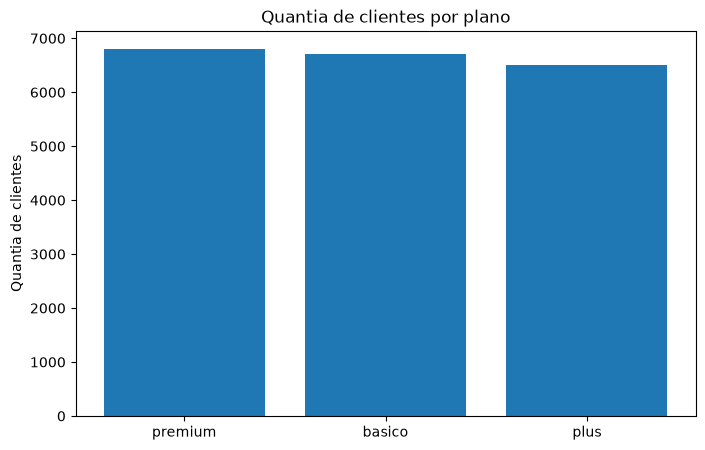
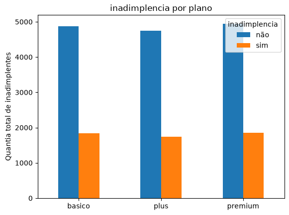
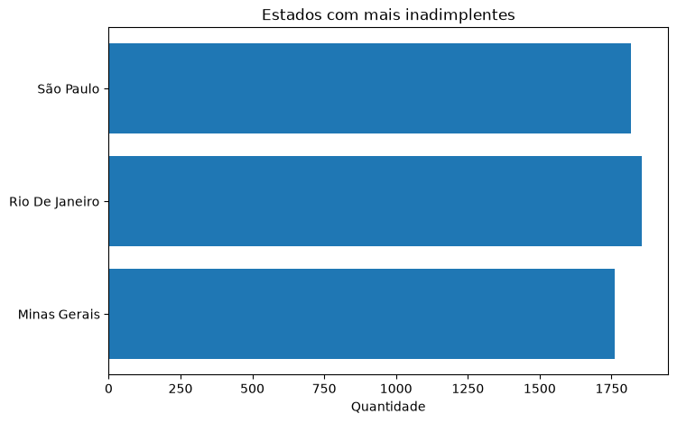

# Assistente de Telecom

● Agente de IA para consulta de dados de clientes de telecom em linguagem natural, desenvolvido com
Google ADK, Gemini e Streamlit.

● Acesse o app: [assistente-de-dados-ia.streamlit.app](https://assistente-de-dados-ia.streamlit.app/)

● Tecnologias utilizadas:

- Python
- Google ADK
- Gemini
- Streamlit
- SQLite

● Como rodar localmente:

1 - Clone o repositório

2 - Instale as dependências: `pip install -r requirements.txt`

3 - Crie um `.env` com sua chave: `GOOGLE_API_KEY=sua_chave`

4 - Gere o banco de dados: `python main.py`

5 - Rode o app: `streamlit run app.py`

● Ideia do projeto:

Agente de IA que responde perguntas de maneira natural sobre uma base de clientes de telecom. Em vez de filtrar dados manualmente, você pergunta ao agente coisas como "clientes ativos em São Gonçalo" e ele consulta o banco de dados e responde.

● Sobre o projeto:

No projeto foi utilizado Google ADK para a criação do agente, Gemini como modelo de linguagem e Streamlit para a interface. Os dados ficam em um banco SQLite com 20.000 clientes fictícios gerados por script, cobrindo cidades, planos, status, mensalidade, consumo em GB e estados variados.

# Análise de Dados

● Receita total por plano ●

O plano Plus lidera em receita total. Apesar de ter menos clientes, suas mensalidades são até 3 vezes maiores que as de outros planos, enquanto o plano Básico tem mensalidade fixa de R$70,00 e o Premium de R$120,00, o Plus conta com uma mensalidade de R$240,00.

● Distribuição de clientes por plano ●

A base de clientes é bem distribuída entre os 3 planos ofertados, sem concentração significativa em nenhum deles.

● Taxa de inadimplência por plano ●

A taxa de inadimplência se mantém estável em torno de 27% em todos os planos disponíveis, sem nenhuma discrepância visível entre os perfis de clientes.

● Inadimplentes por estado ●

Rio de Janeiro lidera com 1.855 inadimplentes, seguido de São Paulo com 1.818 e Minas Gerais com 1.762.

